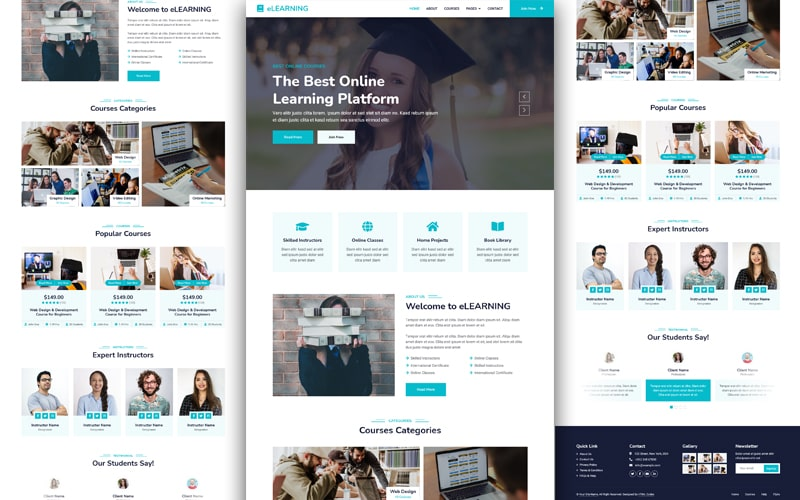
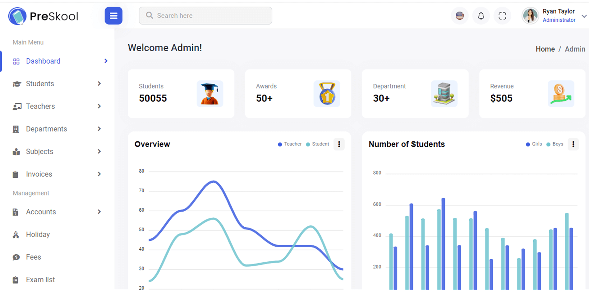

# Laravel School Management Application (S.M.S).

</a>

## This Application Feature 

1. Student Information Create, Read, Update, Delete.
1. Teacher Information Create, Read, Update, Delete.
3. Admin, Student & Teacher different Authentication system.
4. Admin, Student & Teacher different Dashboard.
5. Student Class & Exam Schedule.
6. Student Course List.
7. Student Fee ( Paid & Unpaid ).
8. Online Payment Method.
9. Our School Blogging. 
10. Announcement System
11. Student All Subject List.
12. Accounting ( Free, Salary ).
13. School Library. 
14. School Staff Informational Record
15. School Yearly Calendar Planner

## Optional Feature
1. Multi User Functionality.
2. Smooth User Interface.
3. Data Security & Backup.
4. Generate Report.

